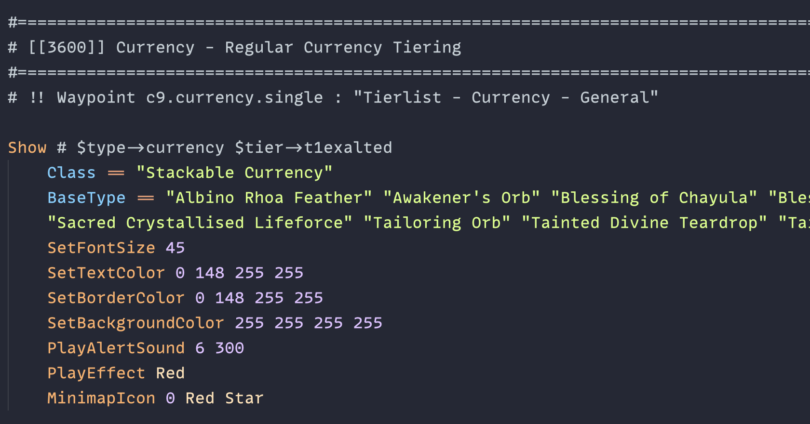
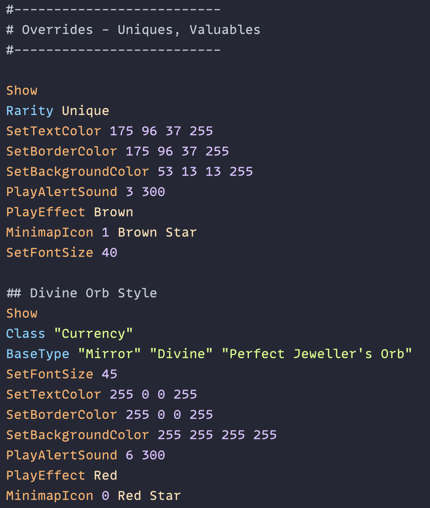

# poe.zed
Path of Exile .filter file extension for Zed.

This extension works for both Path of Exile and Path of Exile 2 filters since both games utilize the same underlying extension and syntax.

Examples (using the `Ayu Mirage` theme):

